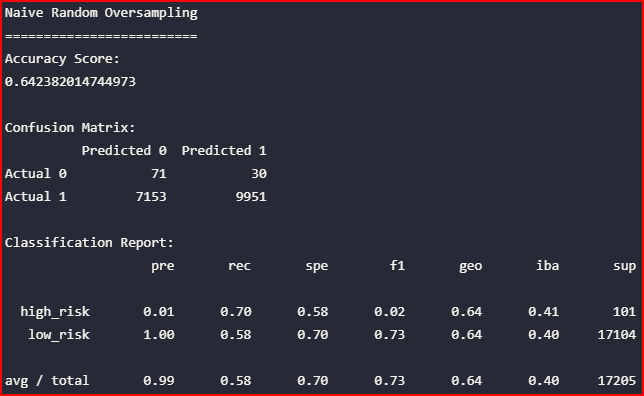
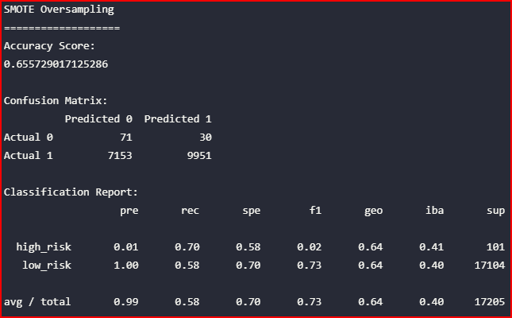
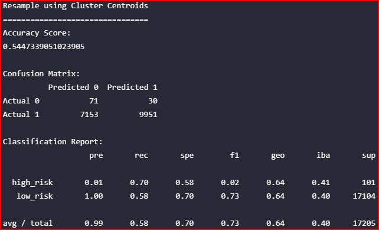
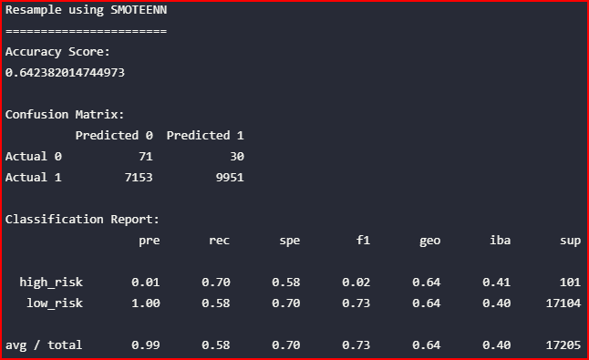
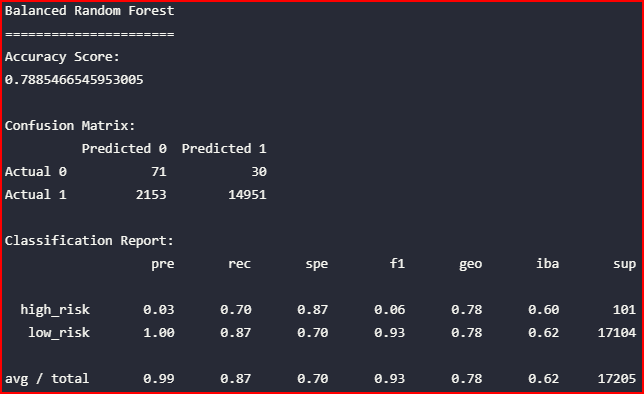
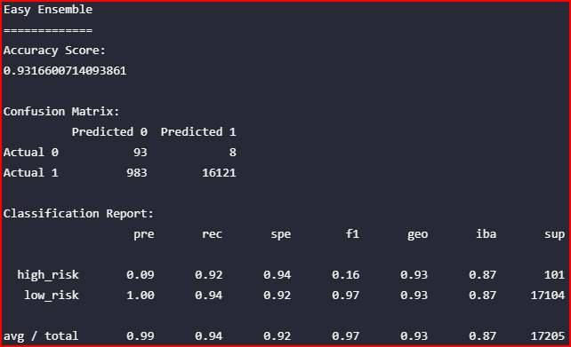

# Credit_Risk_Analysis

## Project Overview

Credit risk is a challenging situation that most individuals or corporate borrowers will encounter when providing or seeking funds for a specific credit basis, such as  a loan. A credit risk is the possibility that a borrower will fail to repay that loan or make the required payments agreed to in a contractual agreement. A lender having taken the risk to provide a loan does not receive the owed principal and interest thus resulting in cash flow disruption or related costs.

In this project we will be using a data set and taking on the credit risk challenge specifically as it relates to creating a viable model that can idetify fraudulent transactions. We will be preparing the data, using statistical reasoning and employing machine learning in an attempt to solve this important challenge.

We have identified credit card risk as an unbalanced classification problem, many loans will be provided and serviced properly, however, a small number of loans will be considered risky. Because of this, we will use different techniques to deploy machine learning to train and then evaluate these models with unbalanced classes. To handle the computational analysis we will be using the imbalanced-learn and scikit-learn libraries to build and evaluate models using resampling.

The credit card dataset is from the LendingClub, a peer-to-peer lending services company. We will oversample the data using the RandomOverSampler and SMOTE algorithms, and undersample the data using the ClusterCentroids algorithm. Then, we will use a combinatorial approach of over- and undersampling using the SMOTEENN algorithm. Next, you’ll compare two new machine learning models that reduce bias, BalancedRandomForestClassifier and EasyEnsembleClassifier, to predict credit risk. Once this has been completed we will make a recommendation as to whether they should be used to predict credit risk.

- Deliverables:

1. Use Resampling Models to Predict Credit Risk
2. Use the SMOTEENN Algorithm to Predict Credit Risk
3. Use Ensemble Classifiers to Predict Credit Risk
4. A Written Report on the Credit Risk Analysis

------------------------------------------------------------------------------------------------------------

## Resources

- Software: Visual Studio Code 1.56.2, Python 3.7.10, Jupyter Notebook v
- Browser : Google Chrome v91.0.4472.124
- Libraries: imbalanced-learn v0.8.0, scikit-learn v0.24.2

------------------------------------------------------------------------------------------------------------

## Results

The results of each sampling method is summarized below, analysis of the following scores are discussed:

- Balance accuracy scores
  - This value is the measure of all correctly identified cases. As such, the model that provided the highest accuracy was the Easy Ensemble Classifier with a score of 93%
- Precision scores
  - Precision is the ability of a classifier not to label an instance positive that is actually negative. Likewise, this provides an accuracy measure of positive prediction. All models provided a high level of precision at 99%.
- Recall scores
  - This identifies what percentage of positive cases were caught by the model. The two models showing a high recall score is the Easy Ensemble and the Balanced Random Forest classifiers at 94% and 87% respectively.

### Naive Random Oversampling

### SMOTE Oversampling

### Combination Over and Under Sampling

### Combination SMOTEENN

### Resampling using Balanced Random Forest Classification

### Resampling using Easy Ensemble Classification

------------------------------------------------------------------------------------------------------------

## Overall Summary

- There is a summary of the results

- There is a recommendation on which model to use, or there is no recommendation with a
justification

- Summarize the results of the machine learning models, and include a recommendation on the model to use, if any. If you do not recommend any of the models, justify your reasoning.
